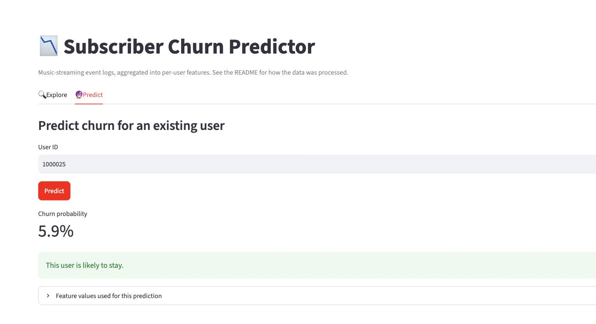

# Subscriber Churn Predictor

[](https://github.com/aaron3636/kaggle_churn_challenge/actions/workflows/ci.yml)

A Streamlit app that explores and predicts subscriber churn from a music-streaming
event log (Kaggle competition `churn-prediction-25-26`, a Sparkify-style dataset).
Built for a course assignment on making a Kaggle project reproducible: a small
`churn` package, pytest tests on synthetic data, `uv`-managed dependencies, Ruff
linting, and a Docker image built and pushed by CI.



## How it works

- **Raw data**: ~17.5M user-event rows (`NextSong`, `Thumbs Up`, `Cancellation
  Confirmation`, ...). Not redistributed here — see [Getting the data](#getting-the-data).
- **Feature engineering** (`src/churn/model.py`): for each user, a single
  "recent vs. history" snapshot (session gaps, listening trends, ad/error/downgrade
  events, tenure) relative to an anchor date. A simplified, single-snapshot version
  of the sliding-window approach explored in `src/sandbox/Carl/final_model.ipynb`.
- **Model**: XGBoost classifier, trained with `GroupKFold` cross-validation by `userId`.
- **App** (`src/churn/app.py`): loads the processed per-user feature table and the
  trained model, and offers an **Explore** tab (filter/chart users) and a **Predict**
  tab (churn probability for a chosen user).

```
src/churn/
  data.py    load_data / clean_data / filter_data — pure, no Streamlit
  model.py   feature engineering, train / save / load, predict_churn
  app.py     Streamlit UI
scripts/
  build_features.py   raw log -> data/processed/users.parquet   (run locally)
  train.py             processed table -> models/churn_xgb.joblib (run locally)
tests/                 pytest, synthetic fixtures in tests/fixtures/
```

The rest of the repo (`Nelson_stuff/`, `src/features/`, `src/pipeline/`,
`src/sandbox/`) is the team's original exploration work and is left as-is.

## Getting the data

The competition data can't be redistributed, so it isn't in this repo. Tests and CI
use a small synthetic fixture (`tests/fixtures/`) instead. To run the app against
the real data:

```bash
pip install kaggle  # or: uv tool install kaggle
kaggle competitions download -c churn-prediction-25-26 -p data/
unzip data/churn-prediction-25-26.zip -d data/churn-prediction-25-26
```

This requires a Kaggle account and API token (`~/.kaggle/kaggle.json`) with access
to the competition.

## Run locally

```bash
uv sync                              # installs Python 3.11 + all dependencies
uv run python scripts/build_features.py   # data/churn-prediction-25-26 -> data/processed/users.parquet
uv run python scripts/train.py            # data/processed/users.parquet -> models/churn_xgb.joblib
uv run streamlit run src/churn/app.py
```

Then open http://localhost:8501.

Run the tests and linter:

```bash
uv run pytest
uv run ruff check src/churn tests scripts
uv run ruff format src/churn tests scripts
```

## Run with Docker

The image ships the code and the trained model (`models/churn_xgb.joblib`, committed
to this repo) but not the processed feature table — mount it at runtime instead,
for the same reason the raw data isn't redistributed:

```bash
docker build -t churn-predictor .
docker run --rm -p 8501:8501 \
  -v "$(pwd)/data/processed:/app/data/processed:ro" \
  churn-predictor
```

Then open http://localhost:8501.

## CI/CD

On every push and pull request, GitHub Actions runs Ruff and pytest. On pushes to
`main`, it additionally builds the Docker image and pushes it to Docker Hub as
`<DOCKERHUB_USERNAME>/churn-predictor:latest`. This requires the `DOCKERHUB_USERNAME`
and `DOCKERHUB_TOKEN` repository secrets (Settings → Secrets and variables → Actions).

## Reproducibility notes

- Python version and all dependencies are pinned via `pyproject.toml` + committed `uv.lock`.
- `models/churn_xgb.joblib` is committed so the app and Docker image work without
  access to the (non-redistributable) raw data.
- `data/processed/users.parquet` and the raw `data/churn-prediction-25-26/` are
  gitignored; regenerate them with `scripts/build_features.py`.
